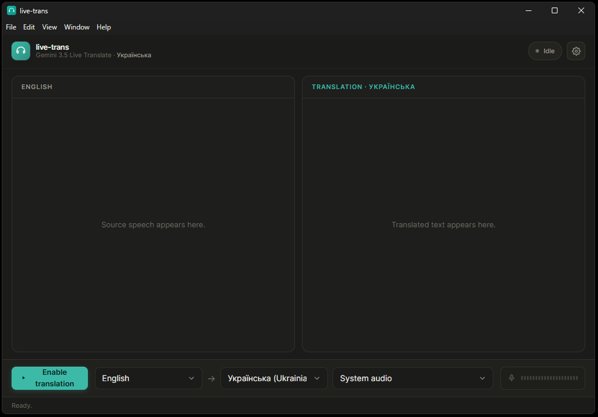

# Live Trans — Remake

[](LICENSE)

A desktop real-time translation app for **system audio and microphone input**, powered by Google's Gemini Live API.

> **This repository is a community remake/fork of the original [Live Trans](https://github.com/minhnhat165/live-trans) by [Minh Nhật Nguyễn](https://github.com/minhnhat165).**
>
> The original project is the foundation for this version. This repository contains substantial changes to the UI, audio pipeline, platform support, reconnection behavior, and subtitles-only workflow.

## Original project & attribution

The original project was created by **Minh Nhật Nguyễn**:

- **Original repository:** https://github.com/minhnhat165/live-trans
- **Original author:** https://github.com/minhnhat165
- **Original project page:** https://launch.j2team.dev/products/live-trans

Please refer to the original repository for the upstream project and its history.

## What this version changes

This remake keeps the core idea of Live Trans — real-time speech translation using Gemini — but changes several important parts of the application:

- 📝 **Subtitles-first workflow** — translated audio playback was removed; the app focuses on source and translated text.
- 🎙️ **Microphone input** — in addition to system audio, you can select an available microphone/input device.
- 🪟 **Windows support** — native WASAPI process-loopback capture with a dedicated Windows helper.
- 🍎 **macOS system-audio capture** — Core Audio process-tap capture with the app's own audio excluded.
- 🔄 **Automatic reconnect / session resumption** — long-running sessions can recover from Live API connection rotation or network drops.
- 📊 **Live source-level meter** — the input signal is displayed in the control bar using an audio-level scale.
- 💰 **Usage and cost tracking** — session token usage and estimated spend are displayed in the UI.
- 🔐 **Encrypted API-key storage** — the Gemini API key is stored through Electron's `safeStorage`.
- 🎨 **Reworked interface** — compact two-column transcript layout, settings and usage panels, status indicators and a simplified control dock.
- 🛠️ **CI builds** — automated Windows and Apple Silicon macOS builds are produced with GitHub Actions.

## Screenshot



*The screenshot above is the project's current UI preview. If the interface changes substantially, this image should be replaced with a fresh screenshot.*

## Features

- Real-time translation of system audio
- Microphone/input-device translation
- Original and translated transcripts side by side
- Automatic source-language detection
- Configurable target language
- macOS and Windows builds
- Automatic Live API reconnect/session resumption
- Live input-level meter
- Session token/cost tracking
- Encrypted local API-key storage
- No translated-audio playback in this remake

## How it works

```
[System audio] ─┐
                ├─► 16 kHz PCM ─► IPC ─► WebSocket ─► Gemini Live API
[Microphone] ───┘                                      │
                                                       ├─► Original transcript
                                                       └─► Translated transcript
```

On macOS, system audio is captured through a Core Audio process tap. On Windows, the native WASAPI process-loopback helper captures the system mix while excluding the application's own process tree.

The application does **not** play the translated audio returned by the Live API. The output is intentionally subtitles-only.

## Download

Prebuilt artifacts are generated automatically by GitHub Actions.

- **Windows** — installer package
- **macOS Apple Silicon** — `.dmg`

See the [Actions](https://github.com/maxud1980/translator/actions) page for the latest successful build artifacts.

## Requirements

- **macOS 14.2+** or **Windows 10 build 20348+ / Windows 11**
- A Gemini API key with access to the required Gemini Live translation model
- [Bun](https://bun.sh) for development/building

Linux is not supported yet.

## Run from source

```bash
bun install
bun run dev
```

For production builds:

```bash
bun run build
```

## Project structure

- `src/main` — Electron main process and native audio capture orchestration
- `src/preload` — secure renderer/main IPC bridge
- `src/renderer` — React UI and audio clients
- `native/win-audio-capture` — Windows WASAPI process-loopback helper
- `.github/workflows/build.yml` — automated Windows/macOS builds

## Roadmap

- Fresh current UI screenshots and demo media
- Transcript export
- Adjustable subtitle appearance
- Global hotkey
- Optional single-application capture
- Linux PipeWire/PulseAudio capture

## License

This repository is released under the **PolyForm Noncommercial License 1.0.0**.

You may use, study and modify the project for noncommercial purposes. Commercial use requires a separate license.

Because this project is based on the original **Live Trans** by Minh Nhật Nguyễn, please also respect the upstream project's license and attribution requirements.

## Credits

**Original Live Trans:** [Minh Nhật Nguyễn](https://github.com/minhnhat165)  
**Original repository:** https://github.com/minhnhat165/live-trans

**Remake / current repository:** [maxud1980/translator](https://github.com/maxud1980/translator)
